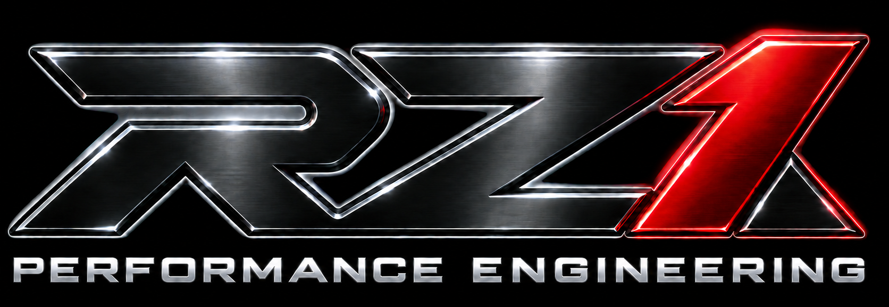

  

<h1 align="center">Riz Datoo</h1>

  <strong>Intelligent Autonomous Systems Architect · AI Systems Engineer · Product & Innovation Architect</strong>

  <a href="https://riz-ai.rz07860.chatgpt.site/">Portfolio</a>
  ·
  <a href="https://github.com/RizAISystems/VIRAL">V.I.R.A.L. Motorsport</a>
  ·
  <a href="https://www.linkedin.com/in/rizrz">LinkedIn</a>

I architect and build intelligent autonomous systems that interpret changing conditions, reason about what should happen next, coordinate models and tools, act within defined authority and preserve the evidence needed to explain what happened.

My work spans the complete system rather than one isolated AI component, including software, decision architecture, controlled execution, validation and physical engineering contexts.

## Featured Engineering

### V.I.R.A.L.™ Motorsport
**Vehicle Intelligence Reference Architecture Lab™**

> **What if the vehicle did not merely generate telemetry, but continuously developed an engineering understanding of its own performance, degradation, limitations and opportunities for improvement?**

A working public demonstrator for **continuous vehicle engineering intelligence** spanning pre-failure awareness, probabilistic diagnosis, bounded preservation, condition-based maintenance, engineering improvement, design-requirement generation and post-modification validation.

**OBSERVE → UNDERSTAND → PREDICT → PRESERVE → MAINTAIN → IMPROVE → DESIGN → VALIDATE → LEARN**

**18 / 18 public tests passing**

[View V.I.R.A.L. Motorsport →](https://github.com/RizAISystems/VIRAL)

---

### Bounded Agentic Execution Architecture

A working public reference architecture demonstrating how intelligent autonomous systems can reason, select tools and execute actions while remaining inside explicit authority, validation and observability boundaries.

Demonstrates:

- explicit authority levels
- approval gates for consequential actions
- controlled tool execution
- pre-execution and post-execution validation
- evidence and audit logging
- failure escalation rather than silent authority expansion
- automated regression testing
- passing GitHub Actions CI

[View repository →](https://github.com/RizAISystems/bounded-agentic-execution-architecture)

## Core Focus

- Systems architecture
- Intelligent autonomous systems
- Agentic and multi-model orchestration
- Vehicle engineering intelligence
- Controlled execution and authority
- Validation, evaluation and governance
- API and MCP-connected systems
- Technical product architecture

## Engineering Approach

I’m most useful when the problem is complex, ambiguous and crosses multiple disciplines.

I take objectives that are not yet fully defined, determine what governs the system, design how models, software, data, physical systems, external services and human controls should interact, then carry that architecture through implementation, testing and refinement.

I use multiple AI systems as specialized engineering resources across research, architecture, implementation, debugging, review and validation while retaining responsibility for the complete system and its technical outcomes.

## Engineering Portfolio

[View the Systems Engineering Portfolio →](https://riz-ai.rz07860.chatgpt.site/)

## Connect

[LinkedIn](https://www.linkedin.com/in/rizrz)  
[X](https://x.com/RizD200)
